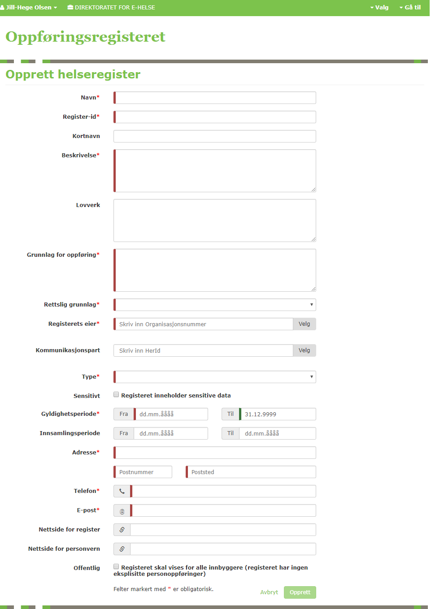

# Startguide

*Sist oppdatert 07.01.2019*

## Hvordan komme igang med Innsynsorkestrator

Implementere integrasjon mot Innsynsorkestrator i hht [Integrasjonsguide](Integrasjonsguide)
-	Utsending av skjemabestilling
-	Mottak av skjemabestilling

Registeret må registreres i Innsynsorkestratoren og i Oppføringsregisteret hos helsenorge.no. Dette må gjøres av Hemit.

Følgende info er påkrevd for registrering i Oppføringsregisteret (de markert med rød asteriks samt "Sensitivt"):

### Eksempel på utfylling av Tonsilleregisteret

**Navn:** Norsk kvalitetsregister Øre-Nese-Hals, Tonsilleregisteret

**Beskrivelse:** Norsk tonsilleregister er et nasjonalt kvalitetsregister for pasienter som får kirurgisk behandling for sykdom og plager relatert til halsmandlene (tonsillene). St. Olavs hospital HF er databehandleransvarlig og Norsk Helsenett er databehandler. Registeret er samtykkebasert, og har som mål å være et nasjonalt register som inkluderer alle berørte behandlingsinstitusjoner i landet. Det viktigste formålet med registeret er å sikre kvaliteten på diagnostikk og behandling av pasienter som tonsilleopereres. Registeret har til mål å bidra til praksis med færre komplikasjoner på landsbasis, og opplysninger fra registeret skal benyttes til kvalitetsforbedring og helseforskning.

**Grunnlag for oppføring:** Norsk tonsilleregister inneholder opplysninger om pasienter som er operert i halsmandlene (tonsillene), og som har samtykket til registrering. Det viktigste formålet med registeret er å sikre kvaliteten på diagnostikk og behandling av pasienter som tonsilleopereres. Registeret har til mål å bidra til praksis med færre komplikasjoner på landsbasis, og opplysninger fra registeret skal benyttes til kvalitetsforbedring og helseforskning.

**Rettslig grunnlag** (en av følgende: Forskrift med krav til samtykke | Forskrift uten krav til samtykke | Konsesjon | Lov): Forskrift med krav til samtykke  
(Juridisk hjemmelsgrunnlag: Datatilsynet ga i februar 2016, med hjemmel i Helseregisterloven § 7, jf. Personopplysningsloven § 33, jf. § 34, konsesjon til å behandle helseopplysninger i Tonsilleregisteret.)

**Registeret inneholder sensitive data:** Ja

**Registerets eier (orgnummer):** NO 883 974 832 St. Olavs Hospital

**Adresse:**  
Norsk kvalitetsregister Øre-Nese-Hals, Tonsilleregisteret  
Seksjon for medisinske kvalitetsregistre  
St. Olavs hospital  
MTFS  
Postboks 3250 Torgarden  
7006 Trondheim  

**Telefon:** 47663704

**E-post:** vegard.bugten@stolav.no; siri.wennberg@stolav.no
